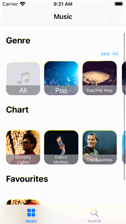
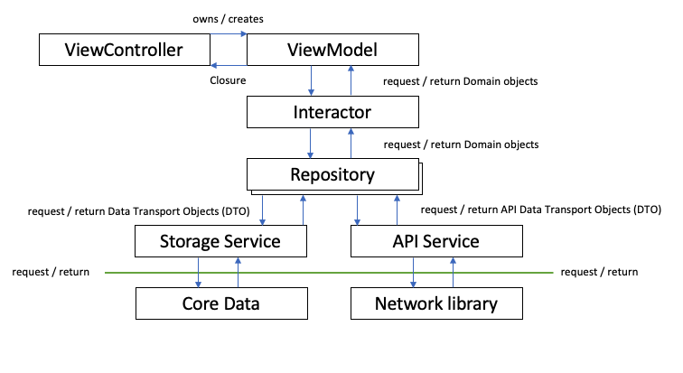

# A Music App using the DeezerAPI

This is an example application that uses the DeezerAPI, in order to show an MVVM architecture.

 

The purpose of this application is to demonstrate the use of flow coordinators, interactors and repositories. The favourites section is stored in CoreData

## Installation
Download the files either from the command line, or download from GitHub's green button in the GUI interface. Dependencies are managed by Swift Package Manager, and can be reset in Xcode through `File> Swift Packacges> Reset Package Caches`. More specifically, the **dependencies** I've used are my own `NetworkLibrary` and `SDWebImage`.

## Architecture
Note this architecture does not use [two-way bindings](https://stevenpcurtis.medium.com/implement-two-way-uikit-binding-in-vanilla-swift-5261d15c918) as the focus here is on Interactors and Repositories. 
 

## Limitations
This App is intended to be an example of the architecture rather than a production ready music application.
The App can only play a preview of songs, rather than full applications.
The API used is deprecated (and the documentation no longer available), and as such the application could stop working at any time.
